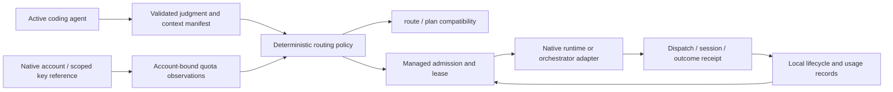

# ADR0001: evolve into a local task router through native runtimes

Date: 2026-09-21. Status: selected for staged implementation under the user's
continued autopilot instruction. Planning tickets #7-#12; parent #1.

## Decision

Build incrementally on the repaired router. Keep deterministic selection and
quota arithmetic in Python. Let the active coding agent supply a validated task
judgment and selected context, while native coding runtimes keep authentication,
tools, streaming and session execution. Add an opt-in managed-dispatch path with
atomic account-aware admission and exact outcome records after those contracts
are tested. Keep existing advisory commands available.

The first independently useful slice is caller-supplied judgment: a coding agent
already understands its task and can route it without provisioning a separate
judge key. This does not make quota probes credential-free or prove all agents
can share all credentials. Native login reuse is preferable to token extraction.

## Evidence and alternatives

See [scope/client matrix](../planning/SCOPE.md),
[credential evidence](../planning/CREDENTIALS.md),
[skill/context contract](../planning/CONTEXT.md),
[lifecycle](../planning/LIFECYCLE.md), and
[evaluation gates](../planning/EVALUATION.md).

A universal API proxy requires protocol translation and API-account boundaries
that do not fix today's launch/observation gaps. A fresh agent runtime duplicates
working native capabilities. An advisor-only design cannot guarantee admission.
Therefore choose native managed tasks plus an advisory compatibility surface.
This is an architectural inference from the evidence, not a provider guarantee
that any subscription can serve arbitrary API callers.

## Components and dependency direction

These are ownership boundaries, not a requirement for six new packages. Extract
code only when a stable boundary has callers and preservation tests. Keep the
standard-library installation, no daemon required and no model in quota math.
Account/credential metadata, context references and task data remain local by
default. Public evaluation uses synthetic/redacted fixtures.

## Compatibility and migration

1. Add caller-judgment input to single-task routing without changing defaults,
   credentials, ladders, launcher templates or state format.
2. Add native account discovery and exact vault references, then bounded context
   manifests. Do not reinterpret old account-unknown snapshots as a selected
   account's current quota. Preserve legacy behavior behind the existing path.
3. Introduce a versioned lifecycle ledger only with the managed path. Migrate
   additive legacy receipts with explicit unknown identity, preserving all active
   holds and denials. Take a local backup and perform a locked, idempotent dry-run
   migration first. Corrupt input is an error, not an empty ledger.
4. One compatible writer generation owns a ledger. Do not run incompatible old
   and new reservation writers during migration. Old command invocations must
   pass through the new compatibility entry point during the pilot.
5. Shadow has no side effects. Enable managed dispatch only for an explicit
   supported adapter after concurrency/crash/account tests pass. Integrate with
   one coordinator before expanding to additional runtimes.
6. Rollback disables new managed admissions, then settles/reconciles every active
   attempt before restoring the backup/legacy writer. Never erase commitments
   merely to downgrade. Caller-judgment rollback is simply omitting the option.

Exact v2 storage format is an implementation contract to finalize with migration
fixtures; choosing JSON versus SQLite before the transaction tests is unnecessary.
Any writer-generation change needs a documented minimum compatible release.

## Stop conditions and retained gaps

The first slice is done when strict, task-bound judgments route without a judge
call; invalid data has no routing side effects; quota vetoes remain effective;
old routing still passes its tests; documentation and CI cover the new path.

The managed-router release is not done until all lifecycle/evaluation gates pass.
Native auth discovery, skill loading, managed launch enforcement, lease renewal,
exact session binding and acceptance feedback are separate implementation work.
Do not announce universal client support or measured cost savings before that.

## Planning disposition

The six planning issues are satisfied by the linked contracts and this staged
choice. Their closure means the design deliverables exist, not that all runtime
features exist. GitHub implementation slices and dependencies are listed in
[BACKLOG.md](../BACKLOG.md). A future API-gateway proposal must bring a concrete
API-client need and supported credential/billing semantics.
