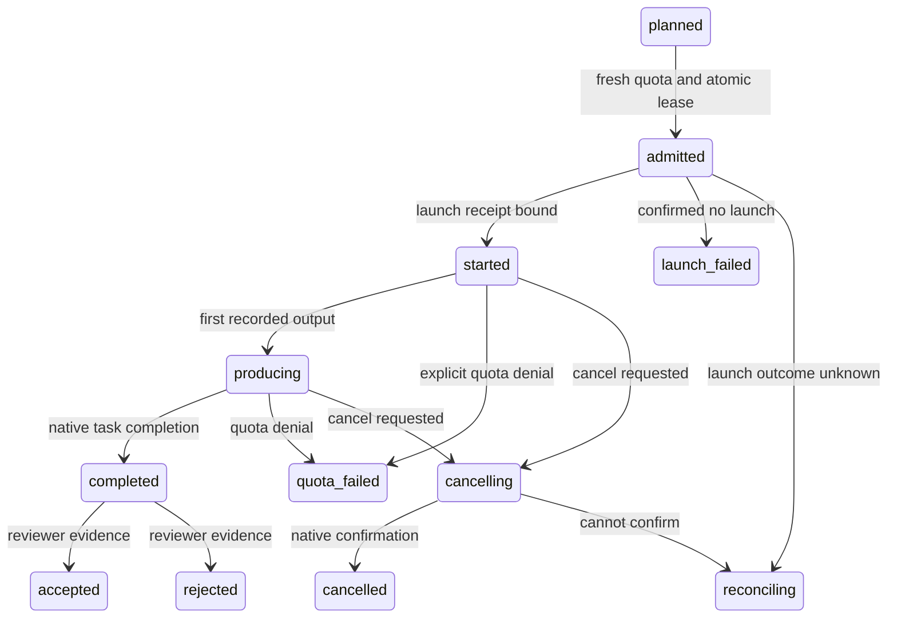

# Admission and outcome lifecycle

Date: 2026-09-21. Ticket: #10. Proposed contract for managed dispatch.

## Identity and records

A task ID is stable across retries. Each attempt has a new decision ID and attempt
ID. A launch has its own idempotency key, reservation ID, native dispatch ID,
session ID and account reference. Suggested worktree names are labels only.
Record spec/context hashes, judgment source, chosen provider/model/effort,
capability floor, quota observations with source/time/account, and lifecycle events.
Never store credentials. Raw task text is optional local data, not public telemetry.

Plan produces no lease. `admit` obtains fresh account-bound telemetry outside the
state lock, then under the lock verifies snapshot freshness/account and every
quota point/slot commitment before taking a lease. If the observation became
stale or the account changed, release the lock and re-probe. Do not hold a global
lock across network operations. All-denied returns a structured wait/retry result,
not a more expensive model or a lower capability floor.

## State machine

Terminal failure/cancellation releases a hold exactly once after ownership is
known. Unknown launch outcome retains a reconciling hold until native status
establishes what happened; do not retry a timed-out worker-start blindly.
Renew active leases with bounded heartbeats. Expiry means reconcile, not proof
the worker stopped. Local process death, coordinator death and disconnected
orchestration each need a recovery fixture. Model output is not acceptance.

## Retry and quota policy

Quota/auth/tool/runtime/quality failures are separate. Quota retries retain the
capability floor, mark the denied account/window, and use another eligible account
only if already authorized. Quality retries carry failure evidence, may raise
capability/effort, and preserve branch/artifact references. Automatic retry count
and spend are bounded; a retry must not repeat external side effects without an
idempotency contract. Unknown errors require classification, not a quota guess.

Use native cancellation/session resume. Changing provider starts another attempt
with an explicit handoff, never assumes opaque tool-call history is portable.
Record observed model/effort separately from the recommendation. Account resets
need fresh healthy telemetry, not arithmetic extrapolation alone.

## Implementation seams and existing gaps

Keep Python standard library and reuse current policy/probe functions. Introduce
small explicit structures only at stable contracts: task/judgment, account/quota,
admission/lease, adapter receipt/event, outcome. Do not split the monolith into
packages just to resemble this diagram.

Current hooks remain advisory; `report --started` accounts for an actual launch.
Current reservations have TTLs and most quota state is provider-scoped. The
existing lock guards slot reservation, not the entire point-budget admission
transaction. The new managed path must establish those stronger guarantees before
replacing a coordinator's dispatch command. Legacy clients stay labelled external
and cannot be advertised as admission-enforced.

Native adapter output is data. Parse supported structured events with bounded
buffers/deadlines and an allowlist of fields; never execute returned shell text.
Use argument arrays for owned processes. For Orca, preserve its authoritative
run/task/dispatch identity and worktree isolation, with one message consumer.
